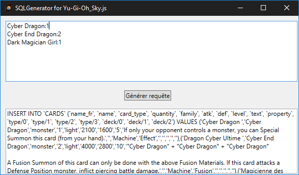

# SQLGenerator for Yu-Gi-Oh_Sky.js

Generates SQL Insert requests for a Yu-Gi-Oh_Sky.js database.

## Screenshots



## How to use

Just launch the app, and enter each card, one per line using this syntax :

```xml
<card_name_en>:<quantity>
<card_name_en_1>:<quantity_2>
```

Then press the button, wait a few seconds and the SQL will be generated in the text box at the bottom of the window. You can copy-paste it to your SQL console.

## Built With

* C# (WPF)

* [Json.NET](https://www.newtonsoft.com/json)
